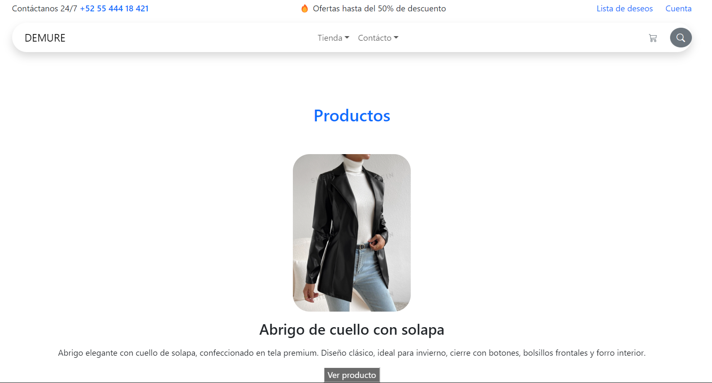
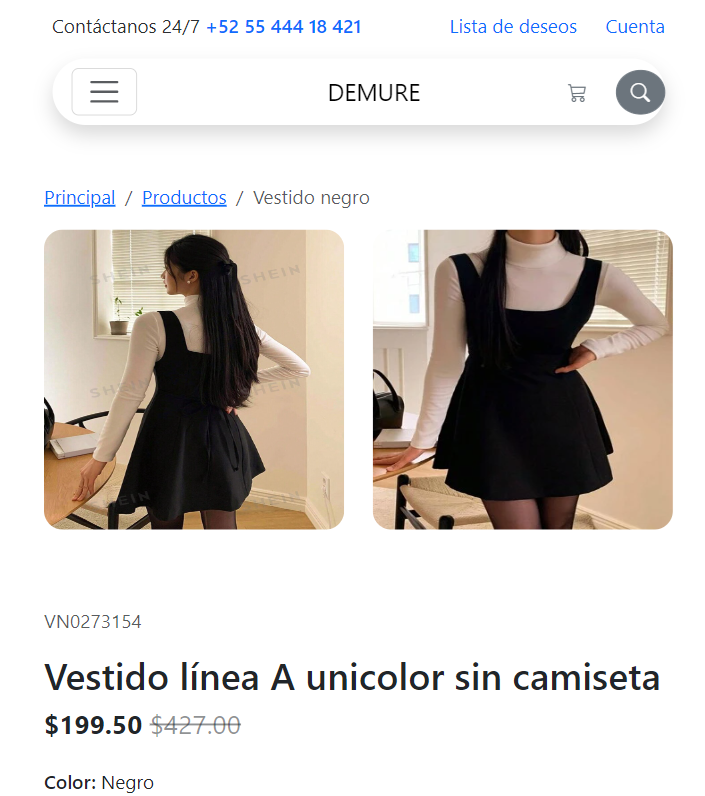
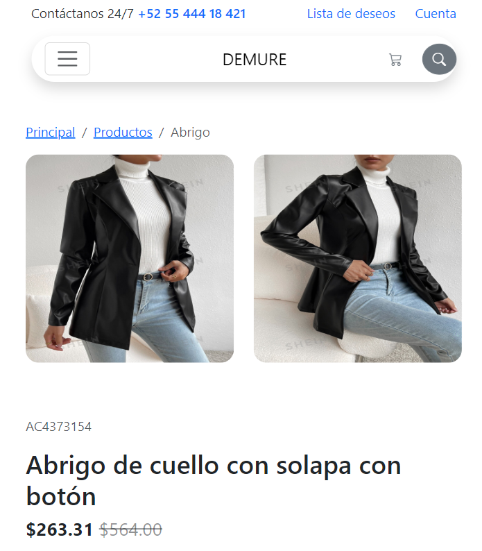
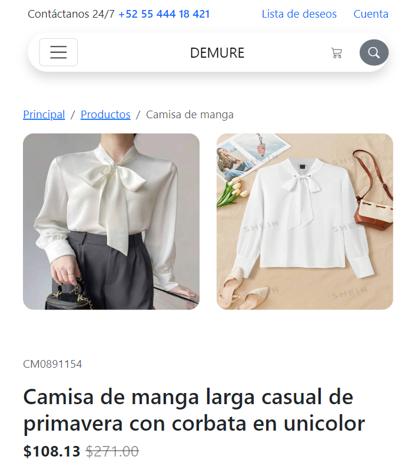
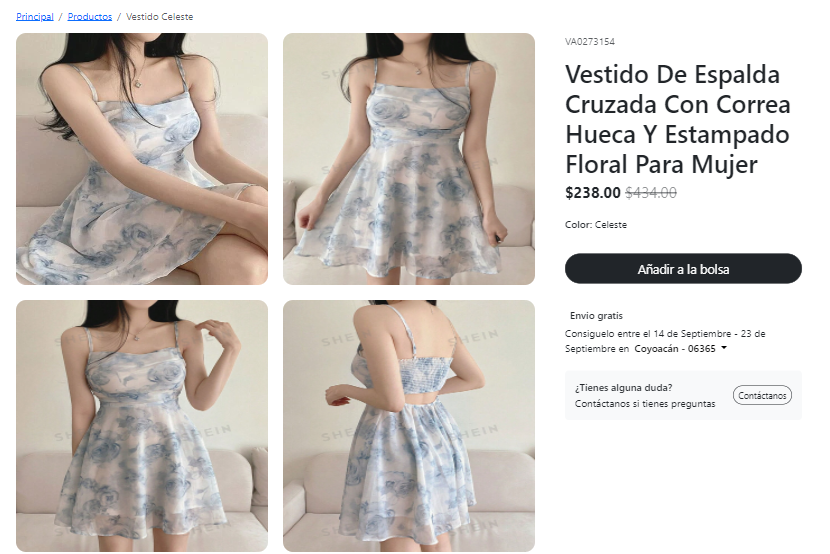
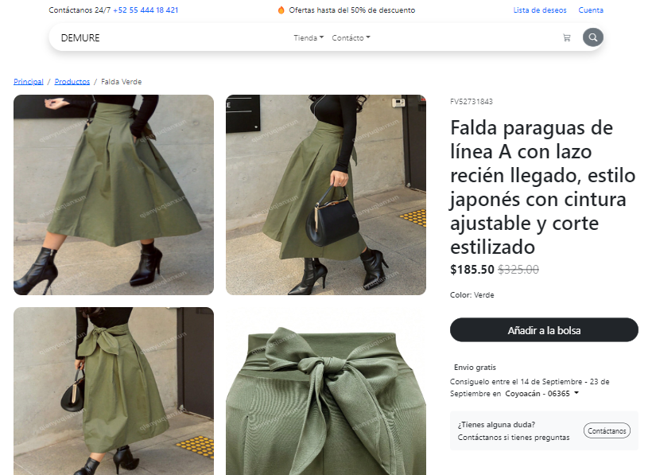
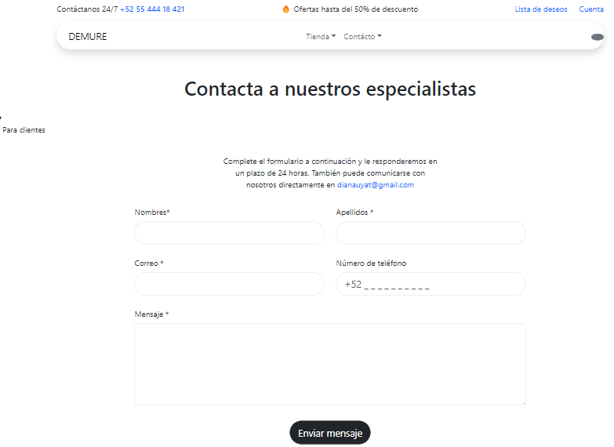

# ACTIVIDAD COMPLEMENTARIA 1

El presente proyecto es una tarea realizada para la materia de Módulo V Desarrollo de aplicaciones de comercio electrónico.

Fue desarrollado con HTML, CSS y con el uso de el framework de UI, Bootstrap utilizando además bibliotecas externas.

La página es responsiva (adaptable a diferentes tamaños de pantalla).

[Proyecto Desplegado (https://sitio-web-theta.vercel.app//)](https://sitio-web-theta.vercel.app/)

## Secciones de mi sitio

## Tecnologías 
* HTML
* CSS
* Bootstrap
---

Desarrollado con ❤️ por Diana Yatziri Mejia Jacinto.
Información e imágenes recolectadas de ©Shein.
